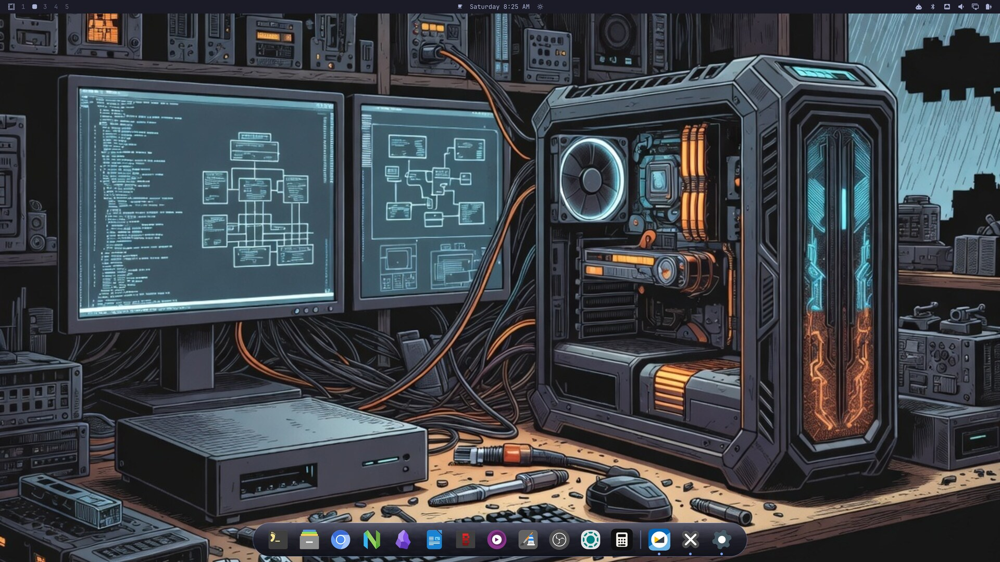

# Floating Dock

An Apple-style floating dock for [Omarchy](https://omarchy.org) — a
mouse-first way to launch, switch, and manage apps on a keyboard-first
desktop.

Built as a native `omarchy-shell` plugin, the same technology as
Omarchy's bar and OSD, so it follows your theme automatically and
survives theme switches without configuration.



## Features

- **Pinned launchers** in a glassy capsule at the bottom of the screen,
  with hover magnification and a launch bounce.
- **Every running app is in the dock**, pinned or not — unpinned apps
  appear to the right of a divider, macOS style, so any open program is
  one click away no matter how it was launched.
- **Click to focus, across workspaces** — clicking a running app takes
  you to its window wherever it lives; the compositor switches
  workspaces for you. Clicking again cycles through that app's other
  windows.
- **A real right-click menu** — *New Window*, a jump list of the app's
  open windows by title, *Quit*, and *Pin / Unpin*.
- **Drag to reorder** pinned icons; the order persists.
- **Auto-hide** (on by default) — the dock slides off-screen when you're
  not using it and slides back when the pointer touches the bottom edge,
  so it never sits on top of your tiled windows.
- **Running indicators** — an accent-colored dot under every app with an
  open window.
- **Theme-aware** — colors derive from the active Omarchy theme, with a
  toned-down treatment on light themes.

Everything above is driven by stable Wayland protocols
(foreign-toplevel management), not compositor-specific APIs — see
[Design notes](#design-notes) for what that buys you.

## Requirements

- Omarchy with `omarchy-shell` plugin support (the `omarchy plugin`
  command).
- Nothing else. Icons look best with the Papirus icon theme installed
  (`/usr/share/icons/Papirus`), which Omarchy ships; the dock falls back
  to your normal icon theme, then to a generic tile, when Papirus
  doesn't cover an app.

## Install

```bash
omarchy plugin add https://github.com/randomchaos7800-hub/omarchy-apple-dock.git --enable
```

Or manually:

```bash
git clone https://github.com/randomchaos7800-hub/omarchy-apple-dock.git ~/.config/omarchy/plugins/dino.dock
omarchy plugin enable dino.dock
```

> **Read before you run.** Plugins execute as arbitrary, unsandboxed
> code inside your long-lived `omarchy-shell` process. Read `Dock.qml`
> before enabling anything you didn't write yourself — this plugin
> included.

To update later: `omarchy plugin update dino.dock`.

## Using the dock

| Action | Result |
|---|---|
| **Click** a pinned app | Focuses its window (switching workspaces if needed), or launches it if it isn't running |
| **Click** a running app again | Cycles to that app's next window |
| **Click** an unpinned running app | Focuses it — same as a pinned one |
| **Right-click** any icon | Menu: *New Window* · window jump list · *Quit* · *Pin / Unpin* |
| **Click a title** in the jump list | Focuses exactly that window, wherever it is |
| **Quit** | Closes every window of that app (via the window-management protocol — the app can still prompt to save) |
| **Drag** a pinned icon left/right | Reorders it; an accent bar previews where it will land |
| **Pointer to the bottom screen edge** | Reveals the dock when auto-hidden |

Notes on behavior:

- The launch bounce only plays for actual launches. Focusing an
  already-running window switches instantly, no theatrics.
- Unpinning an app with open windows doesn't quit anything — its icon
  just slides over to the running section.
- The jump list shows up to 8 windows per app.
- Dialogs and desktop-portal helper windows are filtered out of the
  running section; they aren't apps to you.

## Configuration

All three configuration files live in `~/.config/omarchy/` — one
directory **above** the plugin checkout. That's deliberate: the shell
reloads a plugin whenever anything inside its directory changes, so
config written into the plugin directory would remount the dock on every
save (and, for the pin file, mid-click). Files there also dirty the git
checkout that `omarchy plugin update` pulls into. Legacy in-plugin
copies of `pinned.json` and `monitor.json` are still read as fallbacks,
so upgrades from older versions keep working with no migration step.

All three files hot-reload on save.

### Pinned apps — `dino.dock.pinned.json`

Normally you never edit this: **right-click an icon** and use *Pin to
Dock* / *Unpin from Dock*, or **drag** to reorder. The file exists so
you can also manage pins like configuration — it's a plain JSON array of
desktop-entry IDs, left to right:

```json
["foot", "org.gnome.Nautilus", "chromium"]
```

The ID is the `.desktop` filename without the extension. List what's
installed with:

```bash
ls /usr/share/applications/*.desktop | xargs -n1 basename | sed 's/\.desktop$//'
```

Sizing rules:

- **10–12 pins is the sweet spot** for icon size at full magnification.
- Past ~12–14, icons shrink to keep the dock under ~86% of screen
  width — the same trade-off the real macOS dock makes.
- **20 is the hard cap**; entries past 20 are dropped with a warning in
  the shell log.

A typo'd ID still renders (generic icon, the ID as its label) rather
than vanishing, so mistakes are visible instead of silent.

### Monitor targeting — `dino.dock.monitor.json`

Single monitor: skip this; the dock uses the first screen Quickshell
enumerates.

Multiple monitors: the file holds one JSON string — any case-insensitive
substring of the target screen's manufacturer, model, or connector name:

```json
"Odyssey G50F"
```

or

```json
"DP-2"
```

Prefer manufacturer/model: it survives a docking station renumbering
connectors across reboots (`DP-5` today, `DP-6` tomorrow), which a bare
connector name doesn't. An unquoted plain string is forgiven too. No
file, or an empty one, means no preference.

### Settings — `dino.dock.settings.json`

One knob today:

```json
{ "autohide": false }
```

`autohide` defaults to **true**: the dock hides about 0.7s after the
pointer leaves it and reveals when the pointer touches the bottom screen
edge. While auto-hide is on, a 2-pixel strip along the very bottom of
the screen is reserved to catch the reveal — the standard hidden-taskbar
trade-off. An open right-click menu or an in-flight drag always holds
the dock on screen. Set `autohide` to `false` for a dock that's always
visible.

## Design notes

**Stable protocols over compositor APIs.** Window tracking, focusing,
cycling, and closing all ride on the Wayland *foreign-toplevel
management* protocol via Quickshell — not on Hyprland-specific IPC. That
means dock behavior survives compositor upgrades untouched. It's also
why the dock has no Minimize (below).

**How app matching works.** Wayland offers no guaranteed mapping from a
window's `app_id` to the `.desktop` entry that launched it, so the dock
matches conservatively, in order: exact desktop-entry ID, the entry's
`StartupWMClass`, and — for Chromium-style webapps
(`chrome-app.fastmail.com__mail-Default`) — the site's domain tokens, so
an Omarchy webapp matches its own desktop entry. Matching is
deliberately exact, never substring-fuzzy: `code` can never claim
`code-oss`'s windows, and a short ID can't light the wrong pin's dot.

**Icons.** Papirus art is preferred for its consistent style, falling
back to your icon theme, then to a generic tile — so a window that ships
no icon at all still gets a clickable, visible slot.

### Why there's no Minimize (yet)

Minimize is designed and proven, but deliberately not shipped. Hyprland
has no native minimize; the working equivalent is parking a window in a
hidden special workspace — the same mechanism as Omarchy's scratchpad
(SUPER + S):

```lua
-- park (minimize), no focus change:
hl.dispatch(hl.dsp.window.move({ workspace = "special:minimized",
                                 follow = false, window = w }))
-- restore to whatever workspace you're on now:
hl.dispatch(hl.dsp.window.move({ workspace = tostring(hl.get_active_workspace().id),
                                 follow = false, window = w }))
```

The dock version would be a *Minimize* item in the right-click menu
(macOS "Hide" semantics — all of an app's windows park, its icon dims,
clicking restores to your current workspace).

The reason it's not implemented: everything else in this dock rides on
stable Wayland protocols and survives compositor upgrades untouched.
Minimize would be the one feature bound to Hyprland's embedded Lua API —
a young, fork-specific surface that already broke the classic `hyprctl
dispatch` syntax and can shift again with any Omarchy Hyprland bump. One
feature silently breaking on upgrade would cost more trust than minimize
is worth. If that API settles (or a portable minimize lands in a Wayland
protocol), the recipe above is the whole implementation — PRs welcome.

## Troubleshooting

- **No running dot for an app** — its `app_id` doesn't match its desktop
  entry by any of the rules above. Fix it at the source: add
  `StartupWMClass=<its app_id>` to the app's `.desktop` file. Find the
  `app_id` with `hyprctl clients -j | grep class`.
- **An app shows a generic gear icon** — it resolves to no icon in
  Papirus, your theme, or its desktop entry. Same fix: give its desktop
  entry an `Icon=`.
- **Dock is on the wrong monitor** — set
  `~/.config/omarchy/dino.dock.monitor.json` (see above).
- **Dock seems gone** — auto-hide is probably on; push the pointer to
  the bottom screen edge. If it truly isn't there, check
  `omarchy plugin list` and the shell log under
  `/run/user/$UID/quickshell/by-id/*/log.log` for `dino.dock` errors.
- **Edited a config file and the whole dock blinked** — you edited the
  legacy copy inside the plugin directory, which triggers a full plugin
  reload. Use the `~/.config/omarchy/dino.dock.*.json` locations.

## Removing / disabling

```bash
omarchy plugin remove dino.dock
```

or manually: delete the plugin directory and remove the
`{"id": "dino.dock"}` entry from the `plugins` array in
`~/.config/omarchy/shell.json`. Your config files under
`~/.config/omarchy/dino.dock.*.json` are yours to keep or delete.

## Files

- `manifest.json` — plugin manifest (kind `panel`, `keepLoaded: true`:
  mounted at shell startup and stays up, like the OSD).
- `Dock.qml` — the entire implementation.
- `pinned.json` (in-repo) — first-run defaults, and the legacy fallback
  read until your `~/.config/omarchy/dino.dock.pinned.json` exists.
- `~/.config/omarchy/dino.dock.pinned.json` — your pins (managed by
  right-click and drag; hand-editable).
- `~/.config/omarchy/dino.dock.monitor.json` — optional monitor
  targeting.
- `~/.config/omarchy/dino.dock.settings.json` — optional settings
  (currently `autohide`).

## License

MIT — see `LICENSE`.
